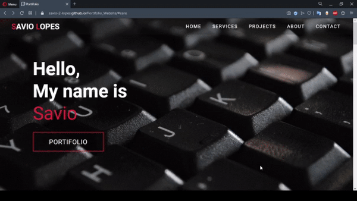

	

  

 🚀 <strong>My Responsive WebSite</strong> 🚧
 

 
 

   
  
  
 
 

  

## :pushpin: Índice

- [Projeto](#sobre)
- [Tecnologias](#tecnologias)
- [Deploy](#deploy)
- [Licença](#licenca)
- [Autor](#autor)

 

## 💻 Sobre o projeto 

Este projeto consistem em uma aplicação Frontend básica de um website responsivo, sem a utilização de frameworks.
 Baseado nos vídeos do canal [WEB CIFAR](https://www.youtube.com/channel/UCdxaLo9ALJgXgOUDURRPGiQ)

 

## ⚙️ Tecnologias
- [X] HTML
- [X] CSS
- [x] JavaScript 

 

## :rocket: Deploy

Para acessar o deploy do projeto, acesse o link abaixo:   
[Website Responsivo](https://savio-2-lopes.github.io/Portifolio_Website/)

  

## :memo: Licença

Este projeto está sob a licença do MIT. Veja a [página de licença](https://opensource.org/licenses/MIT) para mais detalhes.

 

## 🦸 Autor
        
 
 
 
 

Feito com ❤️ por Savio Lopes 👋🏽 [Entre em contato!](https://www.linkedin.com/in/savio-lopes/)
